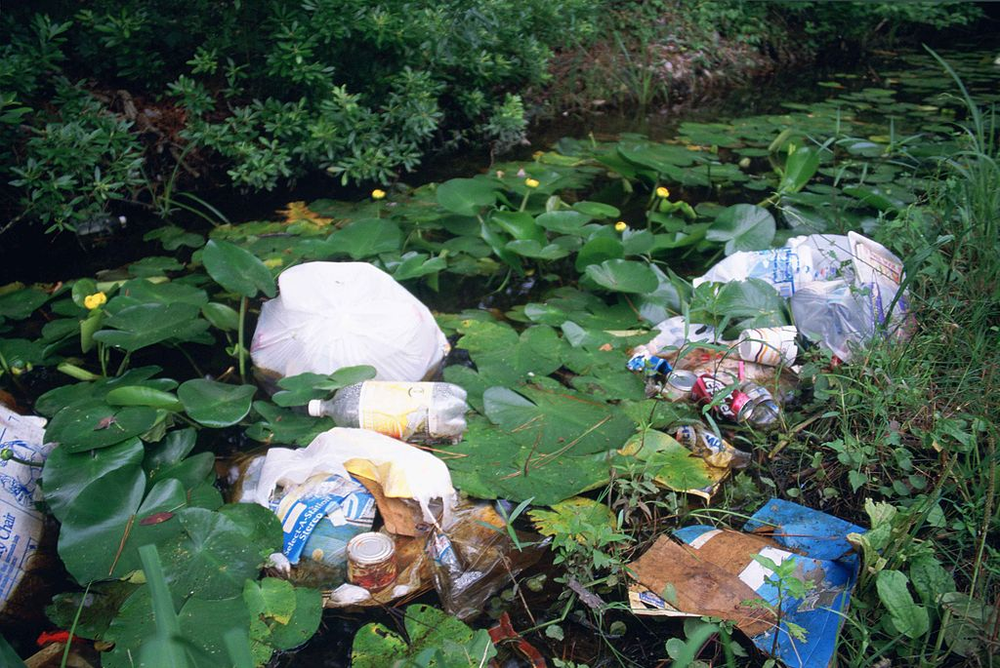
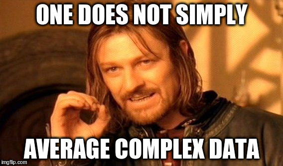

---
title:
output:
  revealjs::revealjs_presentation:
    transition: fade
    logo: ../includes/nav_logo.svg
    favicon: ../includes/favicon.ico
    css: ../includes/custom.css
---

## Picture This

Minard's Map
By Martin Grandjean [CC BY-SA 3.0](https://creativecommons.org/licenses/by-sa/3.0)
- [link](https://commons.wikimedia.org/wiki/File%3AMinard's_Map_(vectorized).svg)

## Today's Topics

 

- DRIP
- Homework #1 discussion
- Types of statistical data
- Introduction to R's data.frame
- R's data types v classical statistical data
- LAB: EDA

## DRIP (1)
- Data Rich Information Poor (DRIP)
- Everyone collects data - few master the alchemy of converting their
  data to information
- WHY?
    
## DRIP (2)

- Few analysts (SQL -> Stats)
- Even fewer understand how to make a better chicken
    - How do you get a healthier chicken?
    - Do you weigh it more often, or do you measure the quality of the
      feed?

<small>By Muhammad Mahdi Karim (Own work) [GFDL](http://www.gnu.org/copyleft/fdl.html), via Wikimedia Commons
- [link](https://upload.wikimedia.org/wikipedia/commons/6/60/Rooster_portrait2.jpg)</small>
  
## Homework #1 Discussion: 
- Describe your experience collecting this data?
- Did it make any sense to you?
- Was it important to you?

## Rules Of Data Collection

<small>Ryan Hagerty [Public domain], via Wikimedia Commons 
- [link](https://upload.wikimedia.org/wikipedia/commons/c/c1/Litter_and_garbage_dumped_in_wetland_area_among_water_lilies_and_marsh_plants.jpg)</small>

 

- Think critically about WHY your data was collected
- Garbage in - Garbage Out
- Administrative data is <del>rarely</del> not GOOD data

## Bias In Data
- How is this data biased?
    - Most data is biased (sorry)
- What can we learn from this data?
- What can we _not_ learn from this data?
- Think Critically:
    - How is EHR data biased?
    - How is medical research biased?
- What does all this mean?

## Are There Limits To What Should We Collect? 

 

- Data is collected on you <del>nearly</del> every day. 
- Are there limits to what should be collected?
- Who should decide/control?
- HIPAA?

?

## Types Of Statistical Data (Categorical)
- **Nominal:** no meaningful rank/order (gender)
- **Ordinal:** imprecise differences between consecutive values, but
  have a meaningful order to those values, and permit any
  order-preserving transformation (Likert scales)

## Types Of Statistical Data (Quantitative)
- **Discrete:** Numer of empaneled lives
- **Continuous:** Age
- **Interval:** meaningful distances between measurements defined, but
  the zero value is arbitrary (as in the case with longitude and
  temperature measurements in Celsius or Fahrenheit), and permit any
  linear transformation
- **Ratio scales:** have both a meaningful zero value and the
  distances between different measurements defined, and permit any
  rescaling transformation (money!)

## Discretization

<small>
By Silverije (Own work) [CC BY-SA
3.0](https://creativecommons.org/licenses/by-sa/3.0) 
or [GFDL](http://www.gnu.org/copyleft/fdl.html), via Wikimedia
Commons - [link](https://upload.wikimedia.org/wikipedia/commons/f/fd/Grb_Lackovi%C4%87a.JPG)
</small>

 

- To convert a continuous variable into a categorical variable
- **Example:** The difference between actual age and age groups

## Data.Frame (1)
- An object with N rows and x columns
- Excel calls it a worksheet
- A database calls it a table
- R calls it a Data.Frame
- R comes with many example data.frames:
    - `data()`

## Lab: EDA
- Exploratory Data Analysis (EDA)
- Goals (Today)
    - Visualization
    - Outliers
    - Relationships
    - Avoids reducing complexity to a single data point!

## MEME

## How Much Info In A Single Number?
- Often, data is reduced to a single value:
  - Avg height of an adult woman: 5' 4"
    ([link](https://www.livestrong.com/article/357769-weight-height-for-the-average-american-woman/))
  - Avg American household  income in 2014: $72,641
    ([link](https://en.wikipedia.org/wiki/Household_income_in_the_United_States))
  - A single number only conveys a limited amount of
    info 
      - 50% of women are taller than 5' 4" 
      - 50% of American households had an income below $72,641
      - Height is not skewed - Income is
  - A major goal of EDA is to look for how data is distributed, rather
    than reducing it to a single value

## Relationships

- Another important goal is to look for relationships (correlations)
  in the data
- This <del>is</del> should be an important step in developing a
  hypothesis

 

| Ethnic Category     | Mean Household Income |
|:--------------------|----------------------:|
| Asian alone         |               $90,752 |
| White alone         |               $79,340 |
| Hispanic or Latino  |               $54,644 |
| Black               |               $49,629 |

 

- **Note:** You do not perform NHST while doing EDA

## Quotable:

> The greatest value of a picture is when it forces us to notice what we never expected to see.
> 
> -- John Tukey 

 
<small>

- Although not a strict requirement, EDA tends to be graphical
- That means we get to spend the rest of our day drawing pictures!

</small>

## BREAK!

<image src="../includes/cat-stretch.jpg" width="80%">

 

- It is now time to start programming/drawing.
- But first . . . take 10 minutes . . . and STRETCH!

